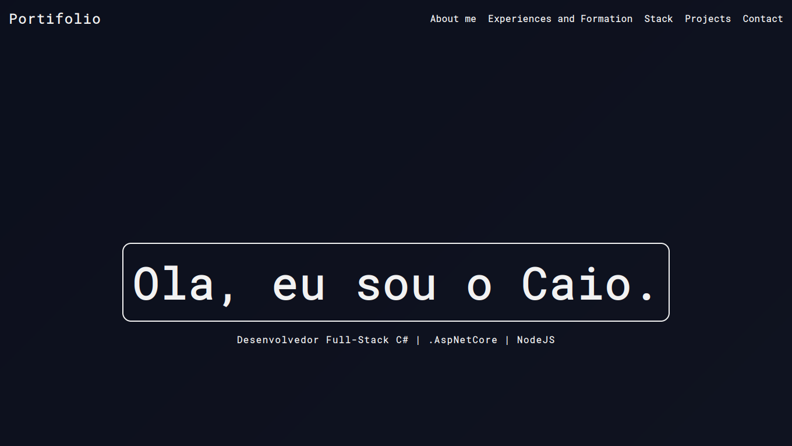

<h1 align="center">Portifolio</h1>

 

----

<h3 align="center">EM DESENVOLVIMENTO</h3>

----

Terceira versão do meu portifolio.
Desenvolvido de forma simples utilizando o minimo de bibiliotecas. 

<h2 align="center">

[View Deployment](https://portifoliocaiocdj.000webhostapp.com/)
</h2>

### Tasks

- [X] intro

- [X] about

- [X] stack

- [x] timeline

- [x] projects

- [X] chrome css and layout bugs

- [ ] contact

- [ ] send e-mail

- [X] texts

 

## Portifolios anteriores 

 

### Portifolio 

[Repositorio](https://github.com/CaioCDJ/Portifoliowww.google.com) 

[live](https://caiocdj.github.io/Portifolio/)

### Portifolio V2

[Repositorio](https://github.com/CaioCDJ/PortifolioV2)

[Live](https://caiocdj.github.io/PortifolioV2/)

